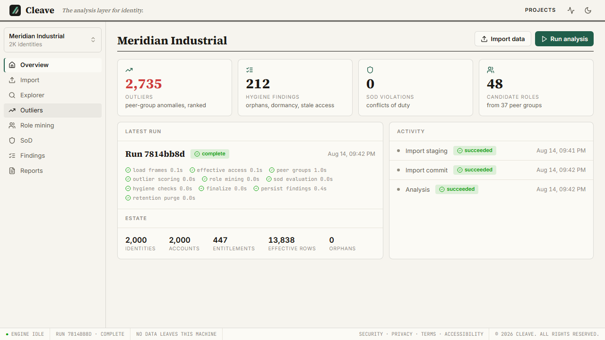
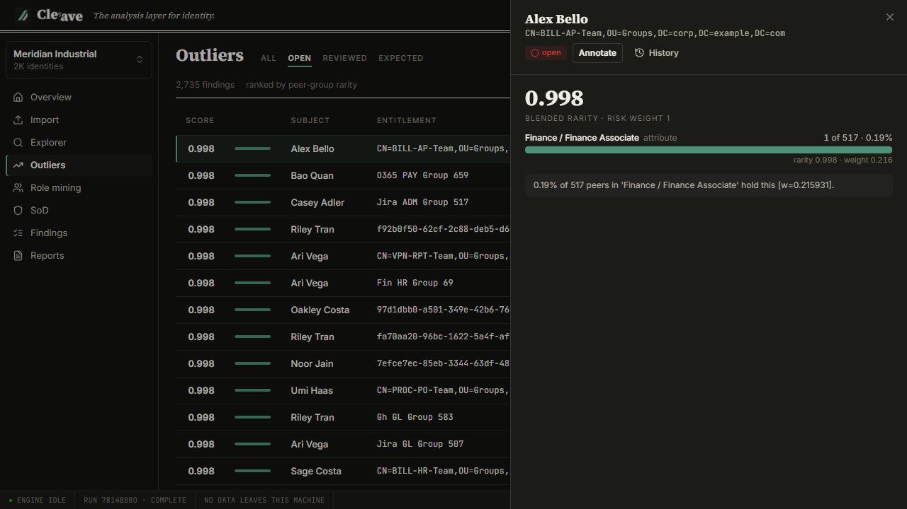
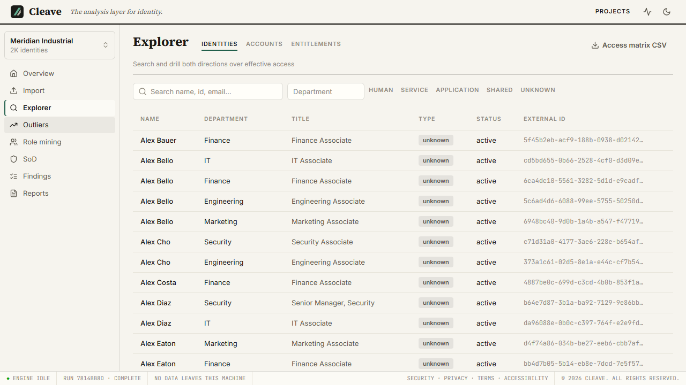
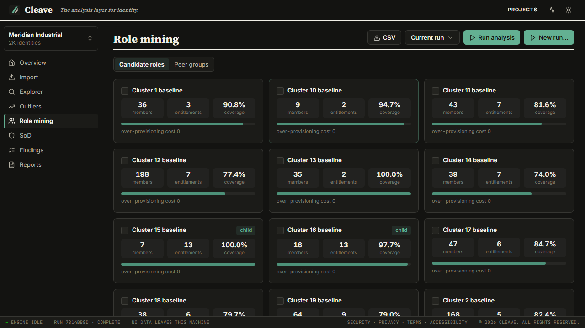

# Cleave

**The vendor-neutral analysis layer for identity.**

Cleave ingests identity and entitlement data from any source (SailPoint, Entra,
Okta, Active Directory, raw application exports), resolves what people can
*actually* reach through nested groups, then mines candidate roles, scores
anomalous access, and produces a report you can hand to a client or an auditor.

It runs entirely on your own machine. No customer access data ever reaches a
vendor server, because there is no vendor server.

> **cleave** *(verb, contronym)* to **split** cleanly along a natural line, and
> to **cling** fast. Cut away what doesn't belong, keep what does.

**Status:** feature-complete, pre-release. Not yet publicly available.
Site: [cleavehq.com](https://cleavehq.com)

---

## This repository

This is the **public engineering showcase** for Cleave. The product source is
private; what lives here is the architecture, the engineering practice, and the
decision record.

| | |
|---|---|
| [ARCHITECTURE.md](ARCHITECTURE.md) | Module map, the enforced boundaries, and why each one exists |
| [ENGINEERING.md](ENGINEERING.md) | The CI gate, testing strategy, supply-chain posture |
| [decisions/](decisions/) | Eight decisions with the measurements that drove them |
| [screenshots/](screenshots/) | Every view, light and dark |
| [synthgen/](synthgen/) | The synthetic data generator, MIT licensed. Real code you can read and run. |
| [site/](site/) | Source of [cleavehq.com](https://cleavehq.com) |

Every number and screenshot below was measured against data
[synthgen](synthgen/) produced, so all of it is reproducible and none of it is
anyone's real access data.

---

## The problem

Real organizations are hybrid. An IGA suite, plus Entra, plus on-prem AD, plus
several dozen applications nobody ever connected to anything. Each vendor's
analytics can only see what that vendor manages, so nobody can answer the
questions that span all of it:

- Who can actually reach the payments application, including through three
  levels of nested group nesting nobody has audited since 2019?
- Which entitlements does this person hold that nobody else on their team does?
- What roles are actually latent in this data, as opposed to the ones on the org chart?
- Where does someone hold both halves of a separation-of-duties pair?

The honest competitor here is not SailPoint. It is a consultant with a pivot
table and a deadline.

## The approach

Three commitments, each of which shows up as a structural property of the code
rather than a line in a policy document:

**Local-first.** A project is a single SQLite file on your disk. The web UI is
served on the loopback interface behind a per-launch session token. The test
suite blocks outbound network access by default, so an accidental call to the
outside world fails the build instead of shipping.

**Deterministic and explainable.** Same input plus same parameters produces
byte-identical findings, enforced by golden-file tests and result fingerprints.
Every finding carries its own `why` payload, so the UI never says "this is
anomalous, trust us." Randomness is always seeded.

**Read-only.** Cleave analyzes and recommends. It never provisions, never
deprovisions, never writes back to a source system. Imports are the only
mutation path and there are no hard deletes.

---

## What it looks like

The overview, after an import and an analysis run:

Outlier findings, with the explanation panel open. The score is
specificity-weighted against the holder's peer group, and the panel shows the
contribution breakdown rather than a bare number:

The access explorer, answering "who has access to X" and "what does Y have"
across every source at once, over *effective* access rather than direct grants:

Mined candidate roles with coverage statistics:

All eight views, both themes

| View | Light | Dark |
|---|---|---|
| Overview | [light-home.png](screenshots/light-home.png) | [dark-home.png](screenshots/dark-home.png) |
| Explorer | [light-explorer.png](screenshots/light-explorer.png) | [dark-explorer.png](screenshots/dark-explorer.png) |
| Outliers | [light-outliers.png](screenshots/light-outliers.png) | [dark-outliers.png](screenshots/dark-outliers.png) |
| Role mining | [light-roles.png](screenshots/light-roles.png) | [dark-roles.png](screenshots/dark-roles.png) |
| SoD | [light-sod.png](screenshots/light-sod.png) | [dark-sod.png](screenshots/dark-sod.png) |
| Findings | [light-findings.png](screenshots/light-findings.png) | [dark-findings.png](screenshots/dark-findings.png) |
| Reports | [light-reports.png](screenshots/light-reports.png) | [dark-reports.png](screenshots/dark-reports.png) |
| Why panel | [light-why-panel.png](screenshots/light-why-panel.png) | [dark-why-panel.png](screenshots/dark-why-panel.png) |

Every screenshot is captured by an automated Playwright run against the real
server, seeded with generated data. None of them are mockups, and none contain
real customer data.

---

## By the numbers

| | |
|---|---|
| Python | ~43,700 lines |
| TypeScript / React | ~13,700 lines |
| Tests | 1,045, all green |
| Engine coverage | 98.4% (gate requires 85%) |
| Schema | 24 tables, 4 stacked migrations |
| Dependencies | fully pinned and hashed, SBOM published, `pip-audit` clean |
| Largest validated run | 3.79M assignments in, 20,220,837 effective-access rows out |

That last row is deliberately not rounded up into a marketing claim. See
[decisions/0005](decisions/0005-nfr2-is-unmet-at-full-scale.md), which documents
in detail the scale target Cleave currently **fails** to meet and by how much.

---

## Stack

Python 3.12 · FastAPI · SQLAlchemy + Alembic · pandas · scikit-learn · networkx ·
SQLite (Postgres-migration-safe) · ReportLab · React 19 + Vite + Tailwind v4 ·
Playwright · nox · uv · ruff · mypy · import-linter

## How it was built

Development runs on [OpenSpec](https://github.com/Fission-AI/OpenSpec): each
capability is a *change* that gets a written proposal, a design document, delta
specs, and a task list **before** any code is written, then gets archived into a
permanent spec once it ships. Requirement IDs (`FR-ING-7`, `NFR-2`) are the
contract, and commits cite them.

Twelve changes shipped this way. The archived design documents are the reason
[decisions/](decisions/) could be written at all: the reasoning was recorded
while it was still fresh, including the parts that turned out to be wrong.

---

## License

Copyright © 2026. All rights reserved.

The documentation, screenshots, and decision records in this repository are
published for evaluation and reference. Cleave itself is proprietary and its
source is not included here.

**Exception:** [`synthgen/`](synthgen/) is MIT licensed and free to use, with its
own [LICENSE](synthgen/LICENSE). It generates fake data and analyzes nothing, so
it gives away none of the product.
