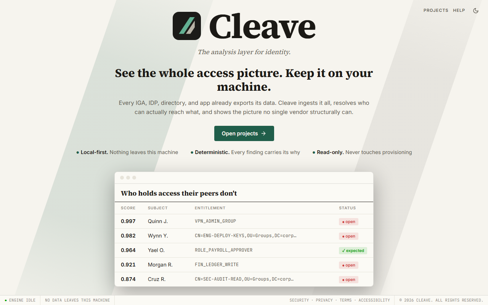

# Cleave documentation

After this page you know what Cleave is, whether it is for you, and which page answers your question.

## What Cleave is

Cleave reads the identity and entitlement exports your systems already produce
(SailPoint, Entra ID, Active Directory, Okta, or a plain users-groups-memberships
export from any application), works out who effectively has what, and shows you
what does not fit: entitlements that are rare among a person's peers, toxic
combinations across systems, orphaned and dormant accounts, and the roles the
data would support. Every finding carries the numbers behind it, so you can
defend it to the person who owns the access.

It runs on your own machine. There is no server, no account and no telemetry:
your client's data goes into a project file at a path you choose and never
leaves it. Analysis is deterministic (the same data and parameters give the same
findings, and every export records the parameters that produced it) and
read-only (Cleave never provisions, revokes or writes to a source system).

## Who it is for

The person doing an access review or a role-mining engagement, usually an IAM
consultant or an internal identity team, on an estate of a few hundred to a few
thousand identities. Cleave is the analysis step between "here is the export"
and "here is the report", and it replaces the spreadsheet that usually does
that job.

## The pages

| Page | What you get from it |
| --- | --- |
| [Install](install.md) | Cleave running on your machine, and where it keeps things |
| [Your first run](first-run.md) | An analysis and a report on the sample that ships with the product, no licence needed |
| [The licence](licence.md) | What a licence permits, what happens without one, how to install one |
| [Importing your data](import.md) | Getting an export from your source into a project, and understanding everything the wizard says on the way |
| [Running an analysis](analysis.md) | Parameters, scope, jobs, determinism, timing, warnings |
| [What the findings mean](findings.md) | Peer groups, the outlier score, candidate roles, separation of duties, hygiene, annotations |
| [Reports and exports](reports.md) | Excel, PDF, JSON, CSV, the methodology block, IGA role export |
| [Limits](limits.md) | What Cleave does not do yet, with the numbers |
| [Troubleshooting](troubleshooting.md) | The common first-week problems and their fixes |

Read them in that order the first time. After that, each page stands alone.

The same pages are inside the product: open **Help** in the top bar, or follow
the small help links next to the things they explain. Help works without a
network connection.

## Getting help

If something in the product does not match these pages, the pages are wrong
and we want to know. Write to `hello@cleavehq.com` with the version (`pip show
cleave`), your operating system, and what you expected to see. For anything
security-related, `security@cleavehq.com`. The [Troubleshooting](troubleshooting.md)
page says what to include in a bug report.

`cleave-synth` also ships with the product. It is the generator behind the
sample, for developers who want estates of other sizes and shapes; you do not
need it.
