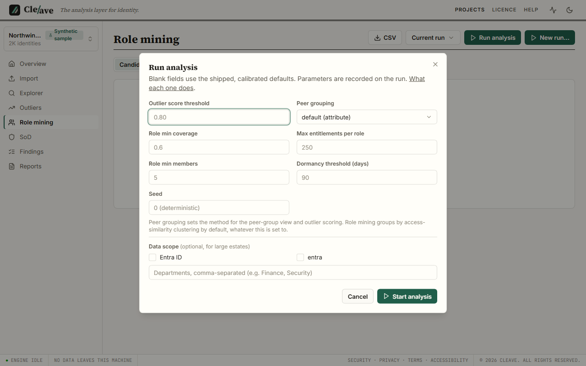

# Running an analysis

After this page you can run an analysis, choose its parameters deliberately, and read what the run recorded about itself.

An analysis takes everything the project holds (identities, accounts,
entitlements, assignments) and produces one **run**: effective access, peer
groups, outlier findings, candidate roles, separation-of-duties violations,
hygiene findings, and warnings. Runs are kept; each one records the parameters
that produced it; nothing a run does changes the imported data.

## Starting a run

Two ways:

- **Run analysis**, on the Outliers view (the Overview's **Run analysis**
  button takes you there), starts a run at the shipped defaults immediately.
  This is the right button almost every time.
- **New run…**, on the Role mining view, opens the panel where the parameters
  below can be changed. Every field is optional; blank means the shipped
  default, which is shown as the placeholder. **Start analysis** submits it.

Either way the run is a background job. On a regular project both buttons are
disabled, with the reason and a link, when the product is read-only
([The licence](licence.md#what-read-only-means)). The sample project always
runs.

## Parameters

The panel exposes the six that matter day to day. The full parameter set is
recorded with every run and printed in every export's methodology block, so
anything below can be checked afterwards.

| Parameter | Default | What it does |
| --- | --- | --- |
| `outlier_min_score` | 0.80 | An entitlement is reported as an outlier only if its score is *above* this. Lower it to see more, at the cost of a longer list; the shipped value was chosen on a 2,000-identity test estate, where it cut roughly 200,000 marginal findings to 25,000 (measured 2026-07-21). See [The outlier score](findings.md#the-outlier-score). |
| `min_coverage` | 0.6 | Role mining: a candidate role must cover at least this fraction of its members' shared entitlements. Higher means tighter, fewer roles. |
| `max_entitlements_per_role` | 250 | Role mining: a candidate carrying more than this is split or dropped. A guard against one giant "everything" role. |
| `min_members` | 5 | Role mining: a candidate needs at least this many members to be reported. Below it you are looking at a person, not a role. |
| `dormancy_days` | 90 | Hygiene: an account whose last login is older than this is dormant. Only checked when a source supplies last-login data ([Warnings](#warnings)). |
| `method` | attribute | Peer grouping. `attribute` groups identities by department and title, which is what most reviews want and what the why panel names. `agglomerative` clusters on entitlement similarity instead, useful when department and title are sparse; the run warns you when they are. |

Two things the panel says that are worth repeating. The default for
`min_coverage` is 0.6, and 0.6 is what a blank field gives you. Changing the
peer-grouping method changes what a "peer" is, and therefore every rarity in
every outlier's why panel; the method used is recorded in the run and shown in
the peer-groups view so a report can never quietly claim a methodology it did
not use.

## Scope

**Data scope** restricts a run to chosen applications, or to chosen
departments, for large estates or a targeted review. A scoped run is recorded
as scoped, and it is **not comparable** to a full run or to a differently scoped
one: rarity is computed among the peers in scope, so the same entitlement can
score differently. Findings outside the scope are never resolved by a scoped
run. The panel says this before you submit. Use scope for a focused engagement,
and use one consistent scope across the runs you intend to compare.

## Jobs, progress and cancel

An analysis is a job. The indicator in the top bar shows its stages with
progress; the Overview's latest-run card shows the stage trace once it
finishes. A job survives you navigating away and reattaches when you come back.
Cancel it from the jobs list. Exports and imports are jobs too, and appear in
the same list.

## Determinism

The same data with the same parameters produces the same findings, the same
scores and the same candidate roles, on any machine. Anything random in the
method is seeded, and the seed is a parameter. This is what lets you re-run
a client's analysis next quarter and know that what changed is the data.

Every run stores its full parameter set, and every export prints it in a
methodology block (the PDF's appendix, the Excel Methodology sheet, the CSV
preamble, a key in the JSON), along with the run's warnings, so a report is
reproducible from the file it came from and honest about what it skipped.

## How long it takes

Measured, on the same Windows 11 / Python 3.12 machine as the install timing:

- **2,000 identities** (the shipped sample, 18,528 assignment rows): 3.2 s on
  2026-08-17; an earlier run of the same estate on the same machine took 9.1 s.
  Single-digit seconds either way.
- **The scaling series** recorded on 2026-07-21 put the generator's
  2,000-identity tier (a larger estate than the sample: several sources, more
  assignments) at 36.5 s once the outlier threshold was raised to its shipped
  value, and showed time and memory growing faster than linearly with
  assignments.
- **50,000 identities / 5,000,000 assignments**: not within the product's
  budget. The one completed run took 31.5 minutes to score and peaked at
  24.37 GB of memory before persistence, which was stopped after 75 minutes.
  This is stated in full on the [Limits](limits.md#scale) page. Do not plan an
  engagement at that scale on this version.

Between those points, expect minutes rather than seconds from around ten
thousand identities, and use scope for anything you would call large.

## Warnings

A run reports what it worked around, and the report prints these unfiltered.
The ones you will see:

| Code | Meaning | What to do |
| --- | --- | --- |
| `dormancy_not_checked` | No source supplied last-login data, so **no** account was checked for dormancy. Zero dormant findings here means the check did not run, not that nothing is dormant. | Import a source with last-login data (Entra sign-in activity, AD `lastLogonTimestamp`), or say in the report that dormancy was out of scope. |
| `dormancy_partial_data` | Some accounts had no last-login value and were not checked; the count is in the warning. | Same; and treat the dormancy list as a lower bound. |
| `termination_status_without_date` | Identities have a terminated-looking status but no termination date, so terminated-with-access could not be checked for them; that check keys on the date. | Add a termination date column to the identity export if you can. |
| `attribute_quality_low` | Department or title is sparsely populated, so attribute peer groups are weak. | Consider the `agglomerative` method, or improve the export. |
| `clustering_size_guardrail`, `role_mining_clustering_size_guardrail` | The estate exceeded the clustering limit, so attribute grouping was used instead of clustering. | Scope the run, or accept attribute grouping. |
| `hierarchy_cycle_broken` | Group nesting contained a cycle; one edge was dropped deterministically to resolve effective access. | Usually a source-data oddity worth mentioning to the client. |

A warning is never a reason to distrust the findings that were produced. It is
a reason not to claim the ones that were not.
