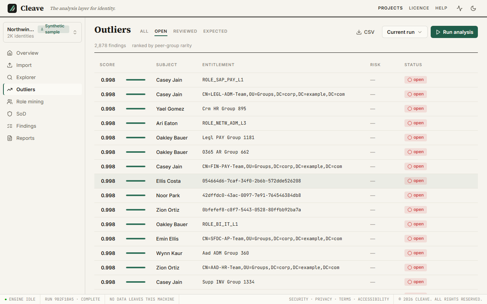
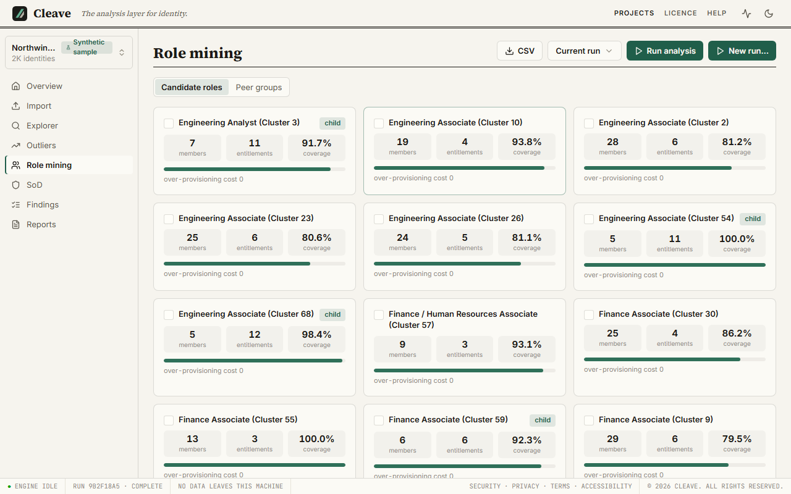
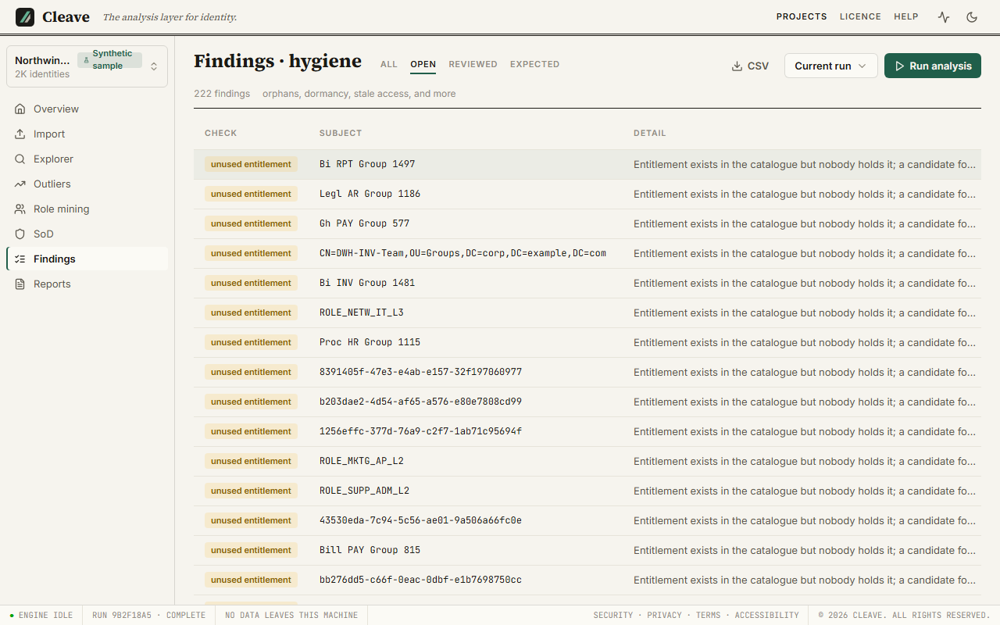

# What the findings mean

After this page you can explain every number Cleave shows to the person who is paying for the engagement.

A run produces three kinds of finding, and each row in the interface and each
row in an export carries its kind: `outlier` (an entitlement rare among the
holder's peers), `sod` (a toxic combination held by one identity) and `hygiene`
(an account or entitlement in a state that needs attention). Every finding also
carries a **why**: the structured facts it rests on. This page is what those
facts mean.

## Peer groups

Almost everything below rests on the idea of a **peer group**: the set of
identities against which one identity's access is judged. By default a peer
group is everyone with the same department and title (the `attribute` method).
Groups smaller than three members are not used, because in a group of two every
unshared entitlement is 50% rare. Optionally (the `agglomerative` method)
identities are clustered by the similarity of what they hold instead, which is
the right choice when department and title are sparse; the run warns you when
they are.

An identity can belong to more than one group (a department group and a
department-plus-title group, say). Each group has a **specificity**: how
narrowly it describes its members. A group of about 25 is treated as most
informative; very small groups have unstable rarities and very large ones
degenerate toward "rare across the whole company", so both count for less when
groups are blended.

The **Role mining** view has a *Peer groups* tab listing every group in the
run, its method and its size. It is worth a look before you defend any outlier,
because the first client question is usually "peers according to whom?"

## The outlier score

An outlier finding says: this account holds this entitlement, and among the
holder's peers, almost nobody else does. The score is a number from 0 upward,
usually below 1 (shown to three decimals in the report), and only findings scoring **above**
`outlier_min_score` (0.80 by default) are reported. Its parts:

### Rarity

Within one peer group, an entitlement's rarity is `1 - holders / members`.
If 1 of 25 peers holds it, rarity is 0.96. If 20 of 25 do, rarity is 0.20 and
you will never see it as an outlier. This is the number the why panel shows per
group, as a bar and a percentage of holders.

### Blended rarity

When the holder is in several peer groups, the rarities are averaged, weighted
by each group's specificity, into one **blended rarity**. A very specific
group (department and title, near the ideal size) pulls the blend toward its
rarity; a broad group pulls less.

### Risk weight

Blended rarity is then multiplied by the entitlement's **risk weight**:

| Risk tag | Weight |
| --- | --- |
| `privileged` | 1.5 |
| `high` | 1.4 |
| `financial` | 1.3 |
| `pii` | 1.2 |
| `medium` | 1.0 |
| `low` | 0.8 |
| untagged | 1.0 |

Tags come from the source where it supplies them and otherwise from a small,
conservative library of name patterns (well-known privileged directory groups,
finance and payment functions, PII stores), each with a confidence. Tags never
change imported data; they sit beside it. Multiplying means a rare privileged
entitlement outranks an equally rare low-risk one, which is what a reviewer
wants; it also means the score can exceed 1.0 (a 0.96-rare `privileged`
entitlement scores 1.44), so a score is not a probability. Read the why
panel's "risk weight" line to see how much of a score is rarity and how much is
weight.

### The why panel

Click any outlier and the panel shows: the blended rarity and the risk weight
with its tag; then each contributing peer group with its name, method, size,
number of holders, the percentage that is, and its rarity; then a summary
sentence. Two things to know when you read it aloud to a client:

- The group list shows at most five groups, **ranked by their weight in the
  blend**, and says "N more groups not shown" when there are more. The summary
  sentence, on the other hand, is written from *all* the groups and orders them
  by **rarity**. So a broad, low-weight group in which the entitlement is
  strikingly rare can appear in the sentence and not in the list. Neither is
  wrong; they answer different questions ("what drove the number" and "where is
  this rarest").
- The order is the engine's. The interface never re-sorts it, so what you see is
  what the export shows and what the report printed.

### Peer-group size

This is the caveat to understand before you rank anything by score. Rarity is a
fraction of the group, so *the same fact*, "one person holds this", scores
differently by group size: in a 417-member group one holder is 0.9976 rare; in a
12-member group one holder is 0.9167. Ranking by score therefore selects the
largest peer groups first, by construction. On a 2,000-identity run measured
while the report was being designed, 28,811 outlier findings spanned 36 peer
groups, and a table of the twelve highest scores showed one group, every row
carrying the same sentence.

The score was deliberately *not* normalised for group size, because that would
be fitting the method to make the top of the list look varied rather than
making it true. The presentation absorbs it instead: the executive report
describes the whole population first (how many findings, how many groups, how
concentrated) and then shows **one finding per peer group** rather than the top
twelve, and the Outliers view lets you filter and sort so you can work group by
group. When you present, do the same: say how many, say where they concentrate,
and pick examples across groups. Do not read the top of a score-sorted list as
"the twelve worst".

## Candidate roles

Role mining looks, within each peer group, for the entitlements held by at
least `min_coverage` of the group (0.6 by default); that set is a **candidate
role** and its members are the people who hold all of it. Near-duplicate
candidates are merged, and where one candidate's entitlements are a subset of
another's the subset becomes a **base role** with the superset pointing at it as
its **parent**. Each candidate reports:

- **Members**: who holds the whole bundle.
- **Coverage**: the share of the peer group's assignments the role explains.
  The benefit of adopting it.
- **Over-provisioning cost**: the grants the role would hand to group members
  who do not currently have them, if the group were standardised onto it. The
  price of adopting it, and the number that decides whether a proposal is
  sensible or reckless. It is measured across the whole peer group on purpose;
  measured across the members it would always be zero.
- **Parent** and the entitlement bundle itself, with **Compare** for putting two
  candidates side by side.

They are called *candidates* deliberately. At the shipped defaults on the
sample estate you get on the order of fifty candidates, some carrying nearly a
hundred entitlements, and nobody ships those untouched. Today, refinement
(renaming, dropping entitlements, splitting) happens outside Cleave: select
the candidates you want, export them ([IGA role export](reports.md#iga-role-export)
or Excel), and shape them there. In-tool refinement is planned and is listed
on [Limits](limits.md#roles-are-candidates).

## Separation of duties

An `sod` finding is one identity holding, across all their accounts and
systems, both sides of a **toxic combination**: create a vendor and approve a
payment, raise a purchase order and receive against it. Rules are pairs of
entitlement patterns (set A, set B), each with a severity, and a violation is
any identity whose effective access matches both. Because effective access is
computed across systems, this catches the combination that no single system's
own controls can see.

Cleave ships **templates**, not active rules: **Seed starter templates** on the
SoD view loads a small library of common fraud patterns as rules you then edit.
The patterns in a template name entitlements the way a textbook does, not the
way your client's catalogue does, so shipping them enabled would produce
violations about entitlements that do not exist and teach you the view is
noise. Seed, map each side's patterns to real entitlement names in the Explorer,
enable, and run.

Two rules about rules: a change to a rule's on/off state or its patterns takes
effect on the **next** run, not retroactively; and changing what a rule means
gives it a new identity, so findings from the old meaning are not silently
resolved by the new one.

## Hygiene

`hygiene` findings are states rather than judgements. Each carries an issue
type:

### Orphan accounts

`orphan_account`: an account that correlation could not link to any identity
([Correlation](import.md#correlation)). Not an import error, a finding: nobody
owns this login. Usually a service account nobody declared, a leaver whose
identity was removed but whose account was not, or a correlation rule that needs
another field.

### Terminated with access

`terminated_with_access`: an identity whose termination date has passed and who
still holds entitlements. Checked against the termination *date*; identities
with a terminated-looking status but no date are counted in a warning and not
checked ([Warnings](analysis.md#warnings)).

### Duplicate accounts

`duplicate_accounts`: one identity with more than one account in the same
application. Sometimes legitimate (an admin account beside a daily one),
always worth listing.

### Unused entitlements

`unused_entitlement`: an entitlement nobody holds. Catalogue debris, or a role
that was defined and never assigned.

### Zero entitlements

`zero_entitlements`: an identity that resolves to no entitlements at all,
through any of its accounts. Either a correlation gap (the accounts exist but
were not linked) or a person who cannot do their job.

### Dormant accounts

`dormant_account`: an account whose last login is older than `dormancy_days`
(90 by default). **Only produced when a source supplied last-login data.** If
none did, the run records `dormancy_not_checked` and emits no dormancy findings
at all; an empty dormancy list is then a check that did not run, not a clean
result. Say so in the report.

## Annotations and review status

Every finding can be marked **Open**, **Reviewed** or **Expected**, with a
note, from its panel; the history of those marks is kept. Findings carry a
**fingerprint** derived from what they are about (this account, this
entitlement, this issue), not from the run, so when you re-run the analysis
next month your annotations carry across to the same finding in the new run,
and a finding that no longer appears is one the data resolved. Filter any
findings view by status to work only what is still open.
