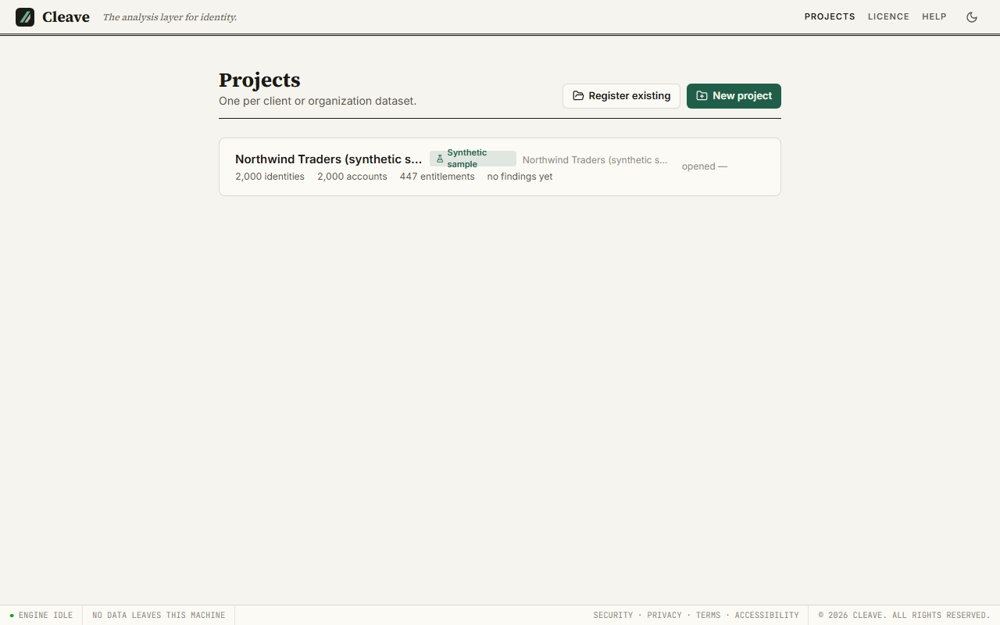
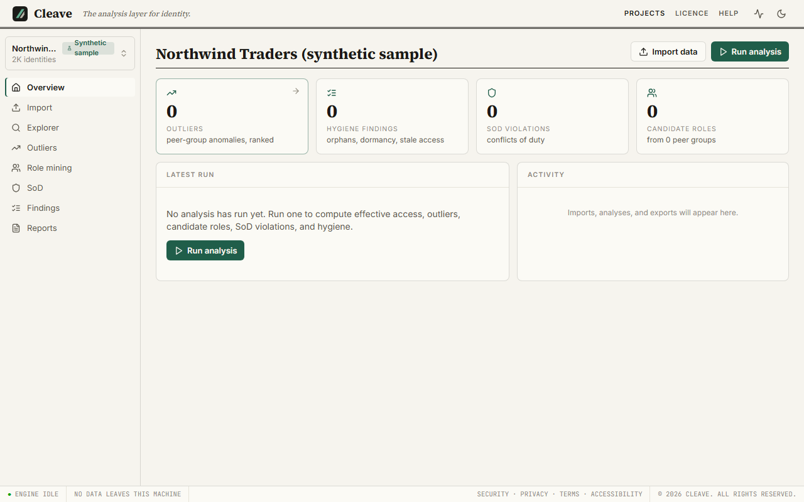
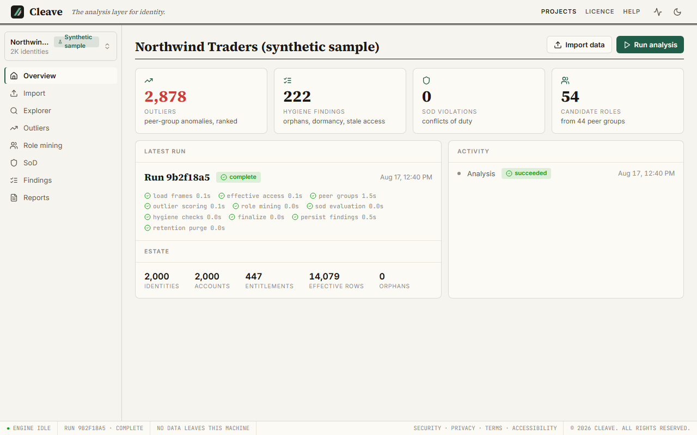
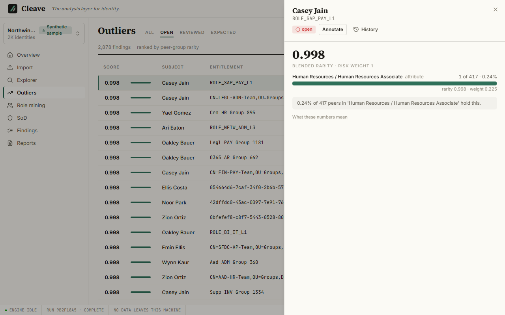
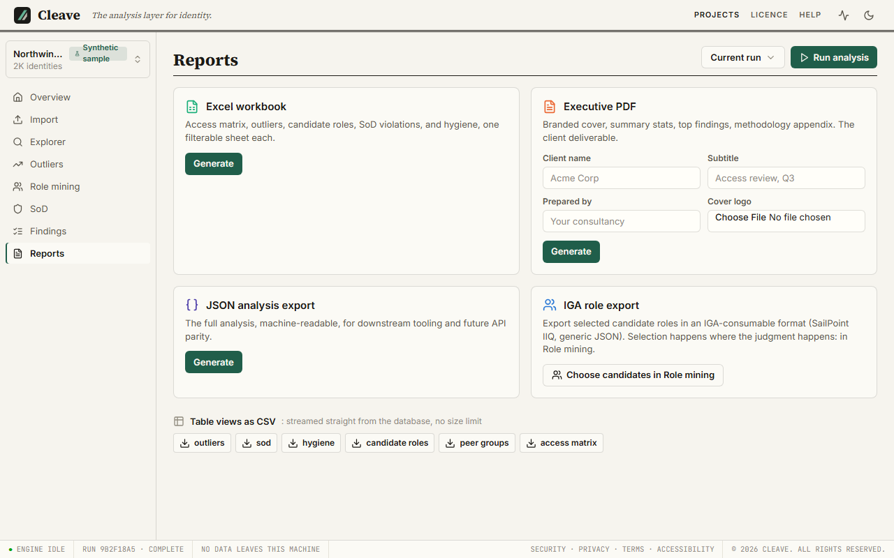

# Your first run

After this page you have run an analysis and generated a report, on data that ships with the product, without a licence.

The whole path is four steps and a few minutes: create the sample, start
Cleave, run the analysis, generate the report. Everything you see is
synthetic; nothing about Northwind Traders is real, and every export from it
says so.

## Create the sample

With your Cleave environment active ([Install](install.md)), in a terminal:

```
cleave-sample
```

This writes a folder `cleave-sample-data` in the current directory and prints
what it did:

```
Wrote a synthetic sample estate to cleave-sample-data
  2,000 identities, 1,499 entitlements
  3 export file(s), 1,249,442 bytes
  answer key: cleave-sample-data\answer-key\ground_truth.json

Created the sample project cleave-sample-data\northwind-sample.sqlite
  2,000 identities imported and committed
  registered in your workspace, no licence needed

The data is synthetic. Northwind Traders does not exist.

Next: run `cleave`, open 'Northwind Traders (synthetic sample)', and click Run analysis.
```

What is in the folder:

- `entra_users.csv`, `entra_groups.csv`, `entra_group_members.csv`: an Entra
  ID-style export of a 2,000-person company. These are what a real Entra export
  looks like to Cleave, and they are what the sample project already holds.
- `READ-ME-FIRST.txt`: the same facts as this section, for someone who finds
  the folder without the documentation.
- `answer-key/ground_truth.json`: the findings the data was built to contain.
  See [The answer key](#the-answer-key) below. It is not an input; do not import
  it.
- `northwind-sample.sqlite`: the sample project itself, already created,
  already holding the three exports, imported through the shipped Entra
  profile, and already registered in your workspace. You do not need to touch
  the import wizard to get to a finding.

Two options you will not need the first time: `cleave-sample --out <folder>`
writes somewhere else, and `cleave-sample --tier <tier>` / `cleave-sample --seed <n>`
build a different estate. The shipped sample is tier `small`, seed `42`, and it
is deterministic: the same two values always produce the same bytes. If you
change either, the command tells you the result is not the shipped sample (the
project it creates is still licence-free, but the wizard will not accept those
files into a sample project; see [The sample project](import.md#the-sample-project)).

Run it a second time and it leaves the existing project alone, re-registers it
if your workspace has forgotten it, and tells you which folder to delete for a
fresh start.

## Start Cleave and open the sample project

```
cleave
```

Your browser opens on the landing page. Go to **Projects**. The sample project
is listed as **Northwind Traders (synthetic sample)** with a *synthetic sample*
badge; the badge is on the project's header too, wherever you are inside it,
so you cannot mistake it for client work. Open it.



You land on the project **Overview**: the estate numbers (identities,
accounts, entitlements, assignments), no analysis yet, and a **Run analysis**
button.



## Run the analysis

Click **Run analysis**. It takes you to the **Outliers** view, which has no run
to show yet and its own **Run analysis** button; click that and the run starts
at the shipped defaults, no questions asked. (When you want to change a
parameter, **New run…** on the Role mining view opens the panel;
[Running an analysis](analysis.md) covers it.)

The run is a background job. On the sample it takes a few seconds (measured
2026-08-17: 3.2 s on the same Windows 11 machine as the install timing;
an earlier run on the same machine measured 9.1 s, so expect single-digit
seconds). The progress indicator in the top bar shows the stages; the Overview
fills in when it finishes.

No licence was involved. The sample project is exempt, always; see [Why the
sample needs no licence](#why-the-sample-needs-no-licence).

## Read the overview

The Overview now shows the run: findings by kind (outliers, separation-of-duties
violations, hygiene issues), each tile a door into its view; the latest-run
card with its stage trace and the estate numbers; and the activity feed. At the shipped defaults on this estate you will see on the order
of 3,000 findings, most of them outliers. That is not a broken estate; it is a
threshold chosen so nothing that might matter is hidden, and the views are
built to be worked, not read top to bottom.

Look at three things:

- **Outliers**: ranked entitlements that are rare among the holder's peers.
- **Role mining**: the candidate roles the data supports, with members,
  coverage and cost.
- **Findings**: hygiene checks, such as accounts that belong to no identity.



**SoD** will be empty: Cleave ships separation-of-duties *templates*, not active
rules, because rules that name entitlements your estate does not have would
only generate noise. Seeding and mapping them is covered in
[Separation of duties](findings.md#separation-of-duties).

## Open one outlier

Go to **Outliers**. Each row is one entitlement held by one account, with a
score. Click a row: the **why panel** opens with the score's parts. Rarity within
each of the holder's peer groups (how many of the group hold it, as a bar and a
percentage), how those groups were blended, and the risk weight applied. Read it
once now, and then read [The outlier score](findings.md#the-outlier-score),
which explains what each number is and why the top of the list looks the way it
does. You will be asked about these numbers by a client; that page is where you
learn to answer.

Mark the finding **Reviewed** or **Expected** from the same panel. Annotations
survive later runs on the same project.



## Generate the report

Go to **Reports**. Under **PDF**, fill in a client name if you like (for the
sample, use `Northwind Traders (synthetic sample)`, which is what the project
is called), a subtitle, who prepared it, and optionally a logo; click
**Generate**. It runs as a job and appears in the list below with a download
button when done. On the sample it takes well under a second to render.



Open it. The cover carries the client name and, because this is the sample
project, a statement that the data is synthetic. That statement is on the
Excel workbook's methodology sheet, in the CSV preamble and in the JSON export
too, and it does not depend on the project's name: renaming the project does
not remove it. Then the summary, the findings section (which describes the
whole population before it shows rows, and shows one finding per peer group
rather than the twelve highest scores, for a reason [the findings page](findings.md#peer-group-size)
explains), the candidate roles, and the methodology appendix listing exactly
which parameters produced everything above.

That is the deliverable. The rest of the documentation is about producing it
from your own data and being able to stand behind it.

## Why the sample needs no licence

Cleave without a licence is read-only: projects open, every view browses,
imports work, but a new analysis and every export need a licence
([The licence](licence.md)). The one exception is the sample project. It runs
fully and forever, because it is how you evaluate the product, and a realistic
estate is a better trial than a time-limited key.

The exemption belongs to the *project*, and it was set once, by `cleave-sample`
when it created the file. It does not depend on the project's name, on the file
names, or on what the data looks like. So:

- Renaming the sample project changes nothing; it is still the sample.
- The sample project accepts only the files `cleave-sample` writes. Import
  anything else into it and the wizard refuses before it opens a snapshot,
  and tells you to create a regular project for your own data.
- A regular project into which you import the sample CSVs is a regular project
  and needs a licence like any other. If you did that by accident, the message
  the product shows names the sample project and the command that creates it.

## The answer key

`answer-key/ground_truth.json` lists what the generator planted: the roles the
company was built from, the outliers it granted on purpose, and the toxic
combinations it seeded. It is there so you can check what Cleave found against
what is actually in the data, which is a fairer test than trusting the tool or
the vendor. Read it *after* the analysis, and read it knowing one thing: the
generator also adds random noise grants that are statistically identical to the
planted outliers, so not every high-scoring outlier is in the key, and that is
by construction rather than a miss.

## How long it takes

Measured 2026-08-17 on Windows 11 / Python 3.12 against the built wheel
installed into a clean environment, with no licence present:

| Step | Seconds |
| --- | --- |
| `pip install` (cold cache; 72.8 s warm) | 79.2 |
| `cleave-sample`: write the estate, create the project, import and commit 18,528 rows, register it | 1.9 |
| Analysis at shipped defaults (2,000 identities, about 3,100 findings) | 3.2 |
| PDF, Excel and JSON exports together | 1.6 |

Everything after the install is under ten seconds; the install is the
download of the scientific stack, and it happens once. Larger estates take
longer, and the honest numbers for that are on the [Limits](limits.md#scale)
page.
