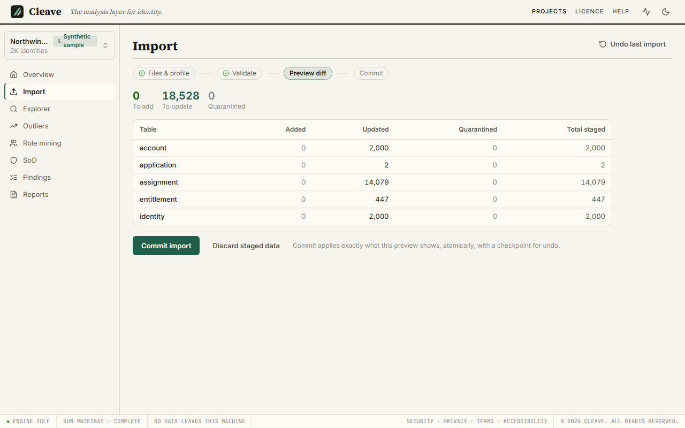

# Importing your data

After this page you can get an export from your source system into a Cleave project and understand everything the wizard tells you on the way.

Importing your own data is the first thing that needs a licence to be *useful*
(analysis and export need one; see [The licence](licence.md)) but the wizard
itself works without one, so you can find out whether Cleave reads your exports
before you buy.

## Projects and the workspace

A **project** is one client's dataset: a single file at a path you choose,
holding every import, every analysis run, every finding and annotation. Make one
per client or per organisation, never one for several. **Projects** in the top
bar lists the ones this machine knows about, which is the **workspace**: a
registry of file paths kept in your app directory ([Where things live](install.md#where-things-live)),
holding no data of its own.

- **New project** asks for a project name and where to put the file. The
  client name printed on report covers is set when you generate the report.
- **Register existing** adds a project file that already exists (one a
  colleague sent you, or one you moved) to this machine's list.
- **Remove** forgets the entry. It never deletes or changes the file, and the
  dialog says so. Delete the file yourself when the engagement is over.

## What Cleave reads

CSV and Excel (`.xlsx`) files, as exported by the source. Specifically:

- **Encodings**: UTF-8 with or without a byte-order mark, and Windows-1252
  (the usual output of older tools). Detected, not asked.
- **Delimiters**: comma, semicolon, tab or pipe, detected per file.
- **Excel**: read as-is, formula *results* rather than formulas, the sheet the
  profile names or the first one. Merged cells are unmerged into every row
  they spanned.
- **Messy files**: a header that is not on row one, trailing summary or junk
  rows, cells holding several values (`a;b;c`) that should be several rows,
  keys with stray whitespace or inconsistent casing. Each of these is handled,
  and *every* cleanup is reported with a count on the Validate step, so nothing
  is silently changed. Your source files are never modified.

If a file cannot be read at all (not a CSV or workbook, an encoding nothing
recognises), the wizard says so at the first step and imports nothing.

## The five input types

Every file you import is one of these, and the profile says which:

| Input type | What it holds | Example |
| --- | --- | --- |
| **identities** | People (and non-human identities: service accounts, applications, shared accounts), one row each, with department, title, manager, status | an HR extract, an Entra users export |
| **accounts** | Login accounts in a system, each belonging to (correlated with) an identity | an application's user list |
| **entitlements** | Things that can be held: groups, roles, permissions, with the application they belong to | an Entra groups export |
| **assignments** | Who holds what: one row per account-to-entitlement grant, or one row per account with a multi-value column | a group-membership export |
| **existing roles** (optional) | Roles already defined in an IGA suite, so mined candidates can be compared with them | an IIQ bundle export |

One input type may be several files (three applications' user lists are all
*accounts*). Cleave models identities and accounts as different things because
a real estate is hybrid: one person, several accounts, in several systems, and
the point of the tool is to see the whole picture across them.

## Profiles

A **profile** tells the wizard, for a given source, which file is which input
type (by file name pattern), which column is the key, how columns map onto
Cleave's fields, and how accounts are correlated with identities. Five ship
with the product. Shipped profiles are read-only; customise one and you save a
copy under a new name, stored in the project file so it travels with it.

For each source below: what to export, what the profile expects the files to be
called, which column it keys on, and one thing to know.

### SailPoint IdentityIQ

Profile: **SailPoint IIQ identity export**.

Export from IIQ (Advanced Analytics or a report task) three files:

- `*identities*`: one row per identity with `identityName`, `email`,
  `department`, `title`, `location`, `managerName`, `cloudLifecycleState`.
- `*entitlements*`: one row per entitlement with `value`, `type` and the
  `application` it belongs to.
- `*access*`: one row per identity with `identityName` and a semicolon-separated
  `entitlements` column, which Cleave splits into one assignment per value.

Key: `identityName`. It is a name, and names can change, so the profile carries
an *acknowledgement* that you accept a renameable key, and the Preview step
warns you about it every time. If your IIQ export can include an immutable id,
customise the profile to key on that instead. Correlation: `email` first, then
`identityName` against the display name.

### Entra ID

Profile: **Entra ID user and group export**.

Export from the Entra admin centre or Graph:

- `*users*`: `objectId`, `displayName`, `userPrincipalName`, `accountEnabled`,
  `department`, `jobTitle`.
- `*groups*`: `objectId`, `displayName`, `securityEnabled`. Every group is an
  entitlement of the application "Entra ID".
- `*group_members*`: `groupObjectId`, `memberUserPrincipalName`, one row per
  membership.

Key: `objectId`, which is immutable, so this profile never warns about its key.
This is the profile the shipped sample uses, and a first import through it
should show no key warnings at all. Correlation: `userPrincipalName`.

### Active Directory

Profile: **Active Directory csvde / PowerShell dump**.

Export with `csvde` or `Get-ADUser | Export-Csv`, tab-delimited (the profile
expects tabs; if your dump is comma-separated, customise the delimiter):

- `*users*`: `sAMAccountName`, `distinguishedName`, `userAccountControl`,
  `mail`, `department`. `userAccountControl` is read as the account's status.
- `*memberof*`: `sAMAccountName` and a semicolon-separated `memberOf` column,
  split into one assignment per group.

Key: `sAMAccountName`, acknowledged as renameable (it can be, though rarely
is), so the Preview warns. If you can export `objectGUID`, key on that.
Correlation: `sAMAccountName` first, then `mail`.

### Okta

Profile: **Okta user and group export**.

From the Okta admin console or API:

- `*users*`: `id`, `login`, `email`, `firstName`, `lastName`, `displayName`,
  `status`, `department`, `title`.
- `*groups*`: `id`, `name`, `description`; every group is an entitlement of the
  application "Okta".
- `*members*`: `groupId`, `userLogin`, one row per membership.

Key: `id`, acknowledged (Okta ids are stable in practice; the profile is honest
that it cannot promise that). Correlation: `email` first, then `login`.

### Generic users, groups and memberships

Profile: **Generic users / groups / memberships**.

For any application that can give you three plain tables:

- `*users*`: `employeeId`, `name`, `email`, `department`, `title`, `manager`,
  `status`.
- `*groups*`: `groupId`, `groupName`, `description`, `application`.
- `*membership*`: `employeeId` and a semicolon-separated `groups` column.

Key: `employeeId` for people (treated as immutable), `groupId` for groups
(acknowledged). Correlation: `employeeId` first, then `email`. Rename your
columns to these headers before import and this profile takes the file as-is;
otherwise map them, next.

### An export that matches no profile

Choose the closest profile (Generic for most raw application exports) and open
it in the wizard's first step. You can change which file pattern is which input
type, pick the key column, and map each source column onto a Cleave field; the
wizard suggests a mapping per column with a confidence, and you correct it. Save
the result under a new name and it is a profile of your own, kept in the project
file, offered next time.

What must be true of any file: a header row somewhere near the top, one column
that identifies each row (the key), and, for assignments, columns that name the
account and the entitlement.

### Saving a customised profile

Anything you change on a shipped profile is saved as a copy under a name you
give it; the shipped one is untouched. Custom profiles live in the project file,
so a colleague who opens the same project has them, and a different project
does not. Correlation rules are edited in the same place and saved with the
profile.

## The wizard

**Import** in a project's sidebar. Four steps, in order, and nothing changes in
the project until the last one.

### Files and profile

Drop or choose the files, pick the profile. The wizard shows which file it
took for which input type and lets you correct it. This is where a mapping is
edited or a profile customised.

### Validate

The files are read, cleaned, mapped and checked, as a background job with
per-stage progress. Every cleanup is counted here (rows skipped before the
header, multi-value cells split, keys normalised). Rows that fail a check are
*quarantined*, not dropped: see [Quarantine](#quarantine).

### Preview

A diff, per table, of what committing would do: rows added, rows updated,
rows quarantined, with drill-down to individual staged rows and the source
file and row number each came from. If the profile keys on a renameable
column, the warning is here, every time. If correlation could not decide
between identities for an account, the candidates are here for you to confirm
([Fuzzy matches](#fuzzy-matches)). And **Quarantine CSV (with reasons)**
downloads every quarantined row with its reason, so you can go back to the
source and fix the export rather than guessing.

### Commit

A deliberate second action. The staged rows are applied atomically; a
checkpoint of the project file is taken first, so an import can be undone
([Undo](#undo)). Until you commit, the project is unchanged and you can start
over.

## Quarantine

A quarantined row is one Cleave read but will not commit, because committing it
would put something ambiguous or unusable into the project. Every one carries a
reason, its source file and its row number, and none is ever silently dropped:
they are excluded from the commit and listed in the Preview and the quarantine
CSV. Fix the export, import again, and the row is taken.

The reasons you will see, and what to do:

### A blank key

The key column is empty or blank on that row (the message says the column is
"empty" or "blank"). Cleave will not key a row on a fallback it did not ask
you about, because a mutable stand-in is how two people become one. Fill the key
in the source or, if the column is wrong, change the profile's key.

### A value that cannot be read

A cell could not be read as the type its field needs: something that is not a
recognisable true/false value in a status column, or not a date in any
recognised format in a date column, or an entitlement with no name. The message
quotes the value. Fix it in the export, or map the column to a field that
accepts free text.

### A duplicate key with conflicting values

Two rows in the same import claim the same key with different data. An exact
repeat is dropped as noise; a *conflicting* repeat is quarantined, because
choosing one silently would be a guess. The message quotes the key as it
appears in your file and the row it conflicts with. Decide which is right at
the source.

### A reference to something not imported yet

An assignment names an account or an entitlement that Cleave has not seen, in
this import or in the project already ("matches no known identity", "matches
no known entitlement"). Usually the files were imported in the wrong order or
one is missing: import identities and entitlements before assignments, or add
the missing file to the same import.

### A mapping that names no columns

The profile's assignment mapping does not say which columns identify the
account and the entitlement. Open the profile and add them (the `references`
of the assignments file). You will only see this on a profile you customised.

## Correlation

Accounts are linked to identities by the profile's correlation rules, in
priority order, exact match first (an email, a UPN, an employee id). What could
not be matched exactly gets one more chance by name similarity, deliberately
strict.

### Uncorrelated accounts

An account no rule matches is **not quarantined**. It is committed with no
identity, and it becomes an **orphan account** hygiene finding after the next
analysis ([Hygiene](findings.md#hygiene)). That is on purpose: an account nobody
owns is a finding, not an import error, and hiding it in a quarantine file would
lose exactly the thing you are looking for.

### Fuzzy matches

If no exact rule matches and the account has a name, Cleave compares it with
identity names and links only above a similarity of 0.90 (a threshold measured
against known ground truth, set well above the point where false merges begin).
Such a link is recorded as *unconfirmed* and raised in the Preview for you to
confirm or reject. If two identities are within 0.03 of each other, the account
is linked to neither, and both candidates are shown. When in doubt, reject: a
missed link becomes an orphan finding you will see; a wrong link merges two
people and you will not.

## Importing again

Import the same source again (next month's export, a corrected file) into the
same project and Cleave upserts: rows it has seen are updated, new rows are
added, and rows that are **absent** from the new export are **never deleted**.
Instead their "last seen" import simply does not advance, so "was in March, not
in April" is a fact you can query and a de-provisioning check you can derive,
rather than data that vanished. Nothing analysis produces ever destroys imported
data either.

## Undo

**Undo last import** on the Import page reverses the most recent committed
import, from the checkpoint taken before it. Annotations you made after that
import are kept. Undo one step at a time, most recent first.

## The sample project

The project `cleave-sample` creates accepts only the files `cleave-sample`
writes, checked by content, not by name. Import anything else into it and the
wizard refuses at the first step, before anything is staged, with:

> The sample project accepts only the files cleave-sample writes; N of the
> selected files are not among them. Create a regular project for your own data
> (analysing it needs a licence).

The rule exists so the licence-free sample cannot be used to analyse your data,
and so a report marked *synthetic* can never contain a real row. Importing the
sample's own CSVs into the sample project again is allowed and is a good way to
watch the wizard work. Selecting the whole sample folder is accepted too (the
README and the answer key are on the list so that "select everything" is not
refused); neither is an input to anything.
