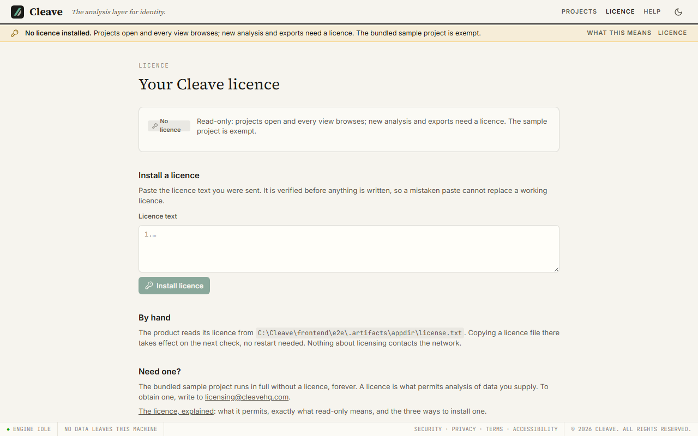

# The licence

After this page you know what a licence permits, what happens without one, and how to install one.

## What a licence permits

A licence lets Cleave analyse and export data you supply. Without one, Cleave
still installs, starts, opens projects, imports your data and lets you browse
everything; what it will not do is run a new analysis on a regular project or
produce an export from one. The sample project is the exception and always
runs ([The sample and the licence](#the-sample-and-the-licence)).

The licence is a single line of text, signed by us, that names who it was
issued to, how many seats, when it was issued and when (or whether) it
expires. It encodes no pricing model and no machine identity. It is verified on
your machine against a public key built into the product; nothing is contacted
to check it, ever.

## Licence states

Cleave is in exactly one of five states, evaluated from the licence file and
your computer's date every time it matters:

| State | Condition | Effect |
| --- | --- | --- |
| `licensed` | A valid licence, not expired | Full function |
| `expiring` | Valid, expires within 30 days | Full function; the interface shows the date |
| `expired` | Valid signature, but the expiry date has passed | Read-only |
| `unlicensed` | No licence file | Read-only |
| `invalid` | A file is present but does not verify | Read-only, with the reason shown |

You can see the state, and everything the licence says, on the **Licence**
page (top bar, or `/license`). In a read-only state a banner across the top of
the interface says so and links there. In `expiring` a quieter line gives the
date. When `licensed`, nothing is shown.

## What read-only means

Read-only refuses exactly three things, and each is refused with a message
naming the state and the way out:

1. **Starting a new analysis** on a regular project.
2. **Generating an export** (PDF, Excel, JSON, IGA role export) from a regular
   project.
3. **Downloading a table as CSV** from a regular project.

Everything else keeps working: opening and creating projects, every list and
drill-down, the Explorer, findings and their why panels, annotations, SoD rules,
the import wizard including undo, downloading an export that was already
produced while licensed, and the jobs list. Import stays open on purpose: it is
your data going into your file, and the wizard is where you learn whether Cleave
reads your exports.

The point of read-only is that a licence lapsing during an engagement never
leaves you unable to show a client their own findings on screen. It does stop
you producing new ones for them until the licence is renewed.

The interface tells you before the server has to: when the project cannot be
analysed or exported, the **Run analysis** and export buttons are disabled with
the reason and a link to the Licence page. If a licence expires while a page is
open, the same message appears when you try.

## Installing a licence

Three ways in; they all end in the same place.

1. **Paste it.** Open the **Licence** page and paste the token into the box.
   Cleave verifies it first and writes the file only if it is valid, so a bad
   paste never replaces a working licence. Line breaks and spaces from an email
   client are ignored.
2. **Copy the file.** Save the token as `license.txt` in the app directory
   ([Where the licence file lives](#where-the-licence-file-lives)). Cleave
   reads it on the next check; no restart is needed. This is the route for an
   air-gapped machine.
3. **Point at a file elsewhere.** Set the environment variable
   `CLEAVE_LICENSE_FILE` to the path of a file holding the token before
   starting `cleave`. It overrides the other two while set, and it is read only:
   pasting in the interface still writes to the app directory.

## Where the licence file lives

`license.txt` in the app directory, next to `workspace.json`:

| System | Path |
| --- | --- |
| Windows | `%LOCALAPPDATA%\Cleave\license.txt` |
| macOS | `~/Library/Application Support/Cleave/license.txt` |
| Linux | `$XDG_DATA_HOME/Cleave/license.txt`, or `~/.local/share/Cleave/license.txt` |

The Licence page shows the exact path for your machine. The file holds the
token and nothing else. It never lives in a project file, so sharing a project
file shares no licence, and it is never written to any log.

## Expiring and expired

Thirty days before the expiry date the state becomes `expiring`: nothing is
refused, the interface shows the date. On the day after the expiry date the
state becomes `expired` and the product is read-only. There is no grace period
after the date; if you have been given one, it is already in the date. Renewal
is a new token, installed the same three ways.

Expiry is compared with your computer's calendar date. We know what that
implies and have chosen not to fight it: this is a licence an honest buyer can
comply with, not copy protection.

## Seats

The licence names a number of seats. Cleave displays it on the Licence page and
does not enforce it: there is no server to count against, and a consultant with
two laptops is exactly the person a hard limit would punish. Comply with it.

## Nothing is transmitted

Installing, checking and using a licence makes no network call in any state.
There is no activation, no phone-home, no periodic check, and no machine
binding. If you have read that a licence check is the one network call Cleave
reserves the right to make: the right is reserved and unused, and this page
will change if that changes.

## Obtaining a licence

Write to `licensing@cleavehq.com`, or use the address shown on the Licence
page in the product (it is the same one, served by the product so it is never
out of date). Say who the licence is for and how many seats. You will receive
the token by email; install it as above.

## The sample and the licence

The sample project that `cleave-sample` creates is licence-exempt, always. It
is how you evaluate Cleave: install, run the sample, see the findings, produce
the report, no signup and no clock. Details are on [Your first run](first-run.md#why-the-sample-needs-no-licence).

Two questions this raises:

**Why does the sample not need a licence when my own project does?** Because
the exemption is a fact about the sample *project*, set once when
`cleave-sample` created it. A licence is what permits analysis of data *you*
supply. The sample project accepts only the files `cleave-sample` writes, so it
cannot be used to analyse your data without a licence.

**I imported the sample files into my own project and it asks for a licence.**
Because that project is a regular project; what it holds does not change that.
Open the sample project instead (it is in your workspace as *Northwind Traders
(synthetic sample)*), or run `cleave-sample` again if it is gone.
